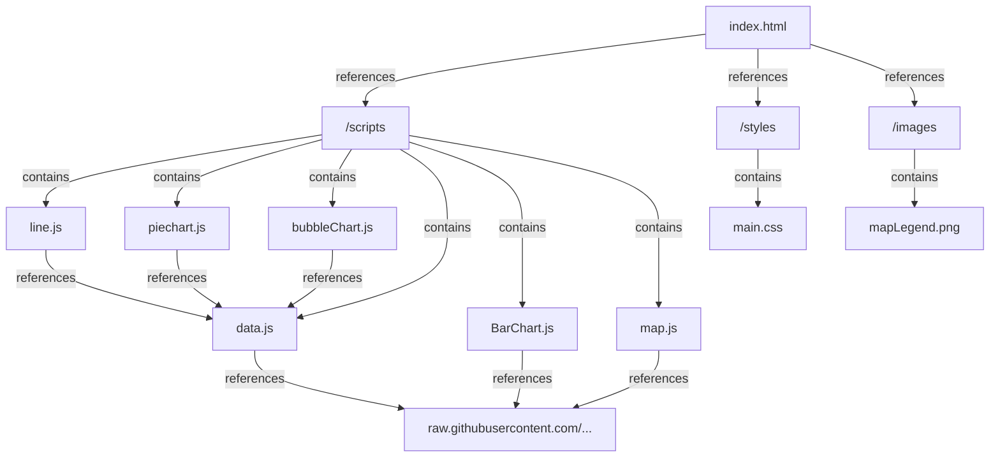

The repo location is [https://gitlab-student.macs.hw.ac.uk/se2004/f20dv-group-project](https://gitlab-student.macs.hw.ac.uk/se2004/f20dv-group-project)

## F20DV Group 9

## Group Members

1. Shivaanee Eswaran @shivaanee H00378416

2. Omar Riyaz @omarriyaz H00346190

3. Sachyith Manoj @sachyith1011 H00361367

4. Samuel Callaghan @sc2012 H00346105

## Initial Project Proposal

The project's main aim is to use data visualizations to understand how COVID-19 vaccines affect number of cases and the mortality rates. By looking into vaccination rates alongside COVID-19 case and death trends, we aim to showcase how effective vaccines are in slowing down the virus's spread. We also aim to pinpoint regional differences in vaccination rates and disease outcomes, shedding light on areas with higher vulnerability.

### Research objectives

Our goal is to extract insights regarding the spread of the virus, vaccination progress, and other relevant trends. We then can answer whether the covid vaccination rates had an impact on the rate of cases and deaths caused by covid.

### Milestones

Visualisations and dashboard designed
Demoed Design Presentation
Individual visualisations created
Dashboard V1 created
Visualisations implemented in the dashboard
Final Presentation Demoed
Final Dashboard finished

#### Dataset description

The Our World in Data COVID-19 dataset is an extensive database that collects information about the COVID-19 pandemic from a number of trustworthy sources worldwide. This dataset is managed by Our World in Data, an organization committed to providing global data on important issues easily available and understandable.

The dataset provides a wide range of information, covering data from more than 20,000 locations worldwide, including but not limited to:
Daily updated COVID-19 cases and deaths by country and region.
Vaccination coverage and distribution.
Testing rates and positivity rates.
Hospitalization and ICU admission rates.
Government responses and policies implemented in response to the pandemic
It also has other miscellaneous information collected from a variety of sources that include median age, population over 70 years of age, amount of male and female smokers etc.

The dataset can be found [here](./data/covid_data.csv). It was taken from its original source [https://github.com/owid/covid-19-data](https://github.com/owid/covid-19-data)

#### Dataset examples

Below is a mostly complete data entry

| Row Number | iso_code | continent | location | date       | total_cases | new_cases | new_cases_smoothed | total_deaths | new_deaths | new_deaths_smoothed | total_cases_per_million | new_cases_per_million | new_cases_smoothed_per_million | total_deaths_per_million | new_deaths_per_million | new_deaths_smoothed_per_million | reproduction_rate | icu_patients | icu_patients_per_million | hosp_patients | hosp_patients_per_million | weekly_icu_admissions | weekly_icu_admissions_per_million | weekly_hosp_admissions | weekly_hosp_admissions_per_million | total_tests | new_tests | total_tests_per_thousand | new_tests_per_thousand | new_tests_smoothed | new_tests_smoothed_per_thousand | positive_rate | tests_per_case | tests_units     | total_vaccinations | people_vaccinated | people_fully_vaccinated | total_boosters | new_vaccinations | new_vaccinations_smoothed | total_vaccinations_per_hundred | people_vaccinated_per_hundred | people_fully_vaccinated_per_hundred | total_boosters_per_hundred | new_vaccinations_smoothed_per_million | new_people_vaccinated_smoothed | new_people_vaccinated_smoothed_per_hundred | stringency_index | population_density | median_age | aged_65_older | aged_70_older | gdp_per_capita | extreme_poverty | cardiovasc_death_rate | diabetes_prevalence | female_smokers | male_smokers | handwashing_facilities | hospital_beds_per_thousand | life_expectancy | human_development_index | population | excess_mortality_cumulative_absolute | excess_mortality_cumulative | excess_mortality | excess_mortality_cumulative_per_million |
| ---------- | -------- | --------- | -------- | ---------- | ----------- | --------- | ------------------ | ------------ | ---------- | ------------------- | ----------------------- | --------------------- | ------------------------------ | ------------------------ | ---------------------- | ------------------------------- | ----------------- | ------------ | ------------------------ | ------------- | ------------------------- | --------------------- | --------------------------------- | ---------------------- | ---------------------------------- | ----------- | --------- | ------------------------ | ---------------------- | ------------------ | ------------------------------- | ------------- | -------------- | --------------- | ------------------ | ----------------- | ----------------------- | -------------- | ---------------- | ------------------------- | ------------------------------ | ----------------------------- | ----------------------------------- | -------------------------- | ------------------------------------- | ------------------------------ | ------------------------------------------ | ---------------- | ------------------ | ---------- | ------------- | ------------- | -------------- | --------------- | --------------------- | ------------------- | -------------- | ------------ | ---------------------- | -------------------------- | --------------- | ----------------------- | ---------- | ------------------------------------ | --------------------------- | ---------------- | --------------------------------------- |
| 82892      | CYP      | Europe    | Cyprus   | 20/03/2022 | 373658      | 22970     | 3281.429           | 930          | 16         | 2.286               | 417025.76               | 25635.96              | 3662.28                        | 1037.938                 | 17.857                 | 2.551                           | 1.15              | 8            | 8.929                    | 143           | 159.597                   | 2                     | 2.211                             | 49                     | 54.161                             | 27492280    | 75402     | 30683.109                | 84.153                 | 90526              | 101.033                         | 0.0384        | 26             | tests performed |                    |                   |                         |                |                  | 28                        |                                |                               |                                     |                            | 31                                    | 80                             | 0.009                                      | 42.91            | 127.657            | 37.3       | 13.416        | 8.563         | 32415.132      |                 | 141.171               | 9.24                | 19.6           | 52.7         |                        | 3.4                        | 80.98           | 0.887                   | 896007     | 1580.7999                            | 11.11                       | 21.35            | 1263.1323                               |

#### Dataset Cleaning

The dataset is filtered in each script individually.

### Data Exploration and Attribute Selection

#### Introduction

An exploratory data analysis was carried out. The full file can be found [here](./eda/data_exploration.ipynb)

#### Dataset exploration

The dataset is first found to be missing many values. It contains 67 attributes, 5 represent as objects and 7 as floats. The attributes with no missing values are iso_code, location, date and population.

#### Code Structure

We started by working on each visualization individually. Then they were all combined for the final dashboard. The main dashboard is located within index.html, which call upon all the .js files inside of /scripts. The styling is under main.css in /styles and the png we created for our map legend is inside /images. The map, bar chart and data .js files are loading the dataset from the GitHub link, and data.js file creates filtered versions of the dataset for bubble chart, line and piechart (the donut chart) .js files use. Additionally our EDA, choices for design and dataset, and all our individual work is also inside of the ZIP folder containing the dashboard.

The main dashboard is located in [index.html](./index.html).
It has a style sheet located in [styles/main.css](./styles/main.css), uses the scripts for visualisations found in [scripts](./scripts) and refences the map legend held in [images/mapLegend.png](./images/mapLegend.png). The scripts references the owid covid data at the [source.](https://raw.githubusercontent.com/owid/covid-19-data/master/public/data/owid-covid-data.csv)

